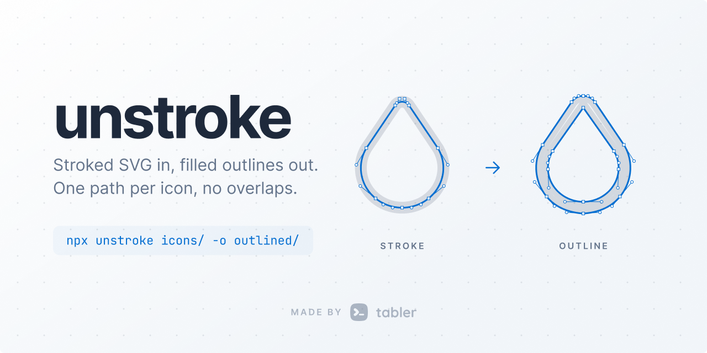

<p align="center">
  <picture>
    <source media="(prefers-color-scheme: dark)" srcset=".github/cover-dark.png">
    
  </picture>
</p>

# unstroke

[](https://github.com/tabler/unstroke/actions/workflows/ci.yml)
[](https://unstroke.vercel.app)

Convert stroked SVG into filled outlines. Every stroke becomes a filled shape,
overlapping shapes are merged with a boolean union, and the whole icon comes
out as a single `<path>` with no self-overlaps. That is what icon fonts, PDF
exporters, laser cutters and design tools that cannot render strokes need.

```
<path d="M3 13h4" stroke-width="2" stroke-linecap="round"/>
        ↓
<path d="M7.966 13.259L7.866 13.5 …Z" fill="currentColor"/>
```

## Why another one?

Most existing converters offset each path segment separately and let the
renderer's nonzero fill rule hide the overlaps. The output *looks* right but
is made of dozens of overlapping subpaths: bigger files, font engines that
choke, and a mess in any vector editor. `unstroke` computes the true union,
so the output is exactly the visible outline and nothing else.

## Usage

```bash
npx unstroke icons/ -o outlined/                 # a whole folder, tree mirrored
npx unstroke icon.svg > icon-outline.svg         # single file to stdout
npx unstroke icons/ -o out/ --optimize           # plus SVGO (needs the svgo package)
```

```ts
import { outlineSvg, outlinePathData } from 'unstroke';

const filled = outlineSvg(svgSource);                       // whole document
const thin = outlineSvg(svgSource, { strokeWidth: 1.5 });   // override the width
const d = outlinePathData('M3 13h4', { strokeWidth: 2, linecap: 'round' });
```

Everything else lives in the documentation at
[unstroke.vercel.app](https://unstroke.vercel.app): every
[option](https://unstroke.vercel.app/reference/options), the
[lower-level API](https://unstroke.vercel.app/reference/lower-level),
[what is supported](https://unstroke.vercel.app/reference/supported),
[how it works](https://unstroke.vercel.app/reference/how-it-works) and a
[comparison with other engines](https://unstroke.vercel.app/reference/alternatives).
The [demo](https://unstroke.vercel.app/demo/) shows every test icon as source,
outline and overlay.

## Development

```
pnpm install
pnpm test
pnpm build
```

### Tests on real files

`test/fixtures/` holds real SVGs: the hardest Tabler icons (180° reversals,
micro segments, tight arcs, spirals, fills mixed with strokes, and every icon
that broke Skia, Paper.js or the previous Tabler pipeline), icons from other
open source sets with different conventions (Feather, Lucide, Heroicons,
Iconoir; see `test/fixtures/open-source/SOURCES.md`) and hand-written files covering basic shapes, transforms, caps,
joins, fill rules, drawing direction, dots, self-intersections and
degenerate input. For each
one the test suite:

1. converts it at stroke widths 0.5, 1, 1.5 and 2, writes each result to
   `test/__output__/stroke-<width>/<group>/<name>.svg` and compares it with
   the committed version (`pnpm vitest run -u` accepts changes),
2. rasterizes the original (with the same stroke width) and the outline and
   requires them to match within 0.05% of pixels.

Drop a new `.svg` into a fixtures folder to cover it; the output file is the
snapshot you review in a pull request.

### Docs and demo

`pnpm docs` starts the VitePress site (http://localhost:5173) with the
documentation and a demo page listing every icon from `docs/icons/` and
`test/fixtures/` as source, outline and an overlay of both. Icons are
converted from `lib/` at build time and on every reload in dev. Vercel builds
the site from this repository, so every pull request gets a preview deployment
and every push to `main` updates [unstroke.vercel.app](https://unstroke.vercel.app).

`scripts/pixel-diff.mts` rasterizes originals and outlines for a whole folder
and reports the worst mismatches; `scripts/diff-image.mts <file>` renders one
icon side by side with a difference image.

## License

MIT. Uses [clipper-lib](https://github.com/junmer/clipper-lib) (Boost Software License).
